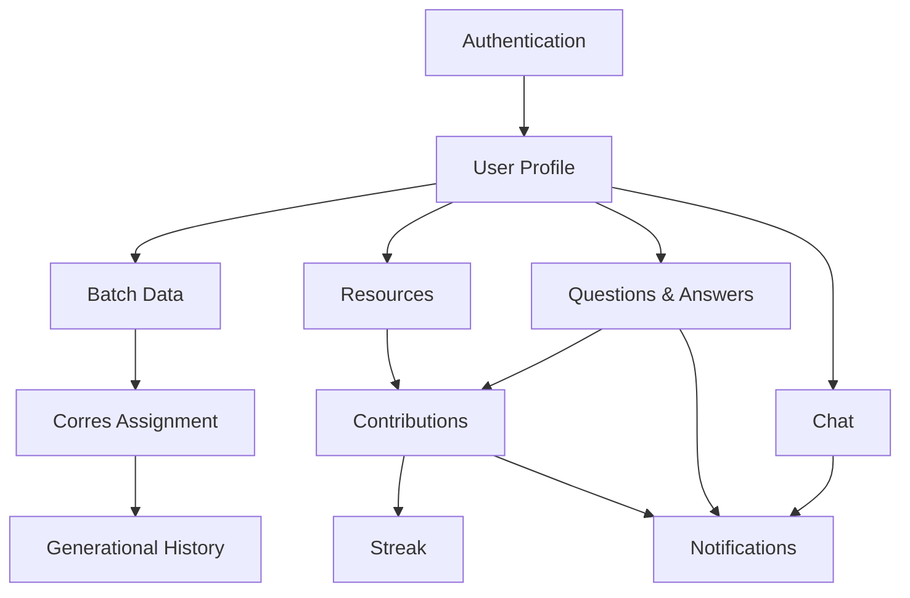

# API Requirements

## 1. API Overview

The backend provides APIs for:

* Authentication
* User and academic profiles
* Batch management
* Automatic Corres assignment
* Generational history
* Resource management
* Questions & Answers
* Real-time chat
* Contributions and streaks
* Notifications
* Administration and moderation

### Base URL

```text
/api/v1
```

### Authentication

Protected endpoints use:

```http
Authorization: Bearer <JWT_TOKEN>
```

---

# 2. Authentication APIs

## POST `/auth/register`

Register a new user.

### Request

```json
{
  "name": "Akhil",
  "email": "akhil@example.com",
  "password": "password",
  "role": "STUDENT",
  "college": "College Name",
  "program": "MCA",
  "branch": "Computer Applications",
  "batch": 2026,
  "rollNumber": 9
}
```

### Response

```json
{
  "message": "Registration successful",
  "user": {},
  "token": "JWT_TOKEN"
}
```

---

## POST `/auth/login`

Authenticate a user.

### Request

```json
{
  "email": "akhil@example.com",
  "password": "password"
}
```

---

## POST `/auth/logout`

Invalidate the current session/token where applicable.

---

## GET `/auth/me`

Return the currently authenticated user's information.

---

## POST `/auth/refresh`

Refresh an expired access token if refresh-token authentication is implemented.

---

# 3. User & Profile APIs

## GET `/users/:id`

Get a user's public profile.

---

## PATCH `/users/:id`

Update profile information.

### Possible fields

```text
name
profilePhoto
bio
college
program
branch
interests
careerGoal
```

---

## GET `/users/:id/academic`

Get academic information.

---

## PATCH `/users/:id/academic`

Update academic information.

```json
{
  "program": "MCA",
  "branch": "Computer Applications",
  "batch": 2026,
  "rollNumber": 9
}
```

---

## GET `/users/:id/contributions`

Get a user's contribution history.

---

## GET `/users/:id/streak`

Get the user's current and longest contribution streak.

---

# 4. Batch APIs

These are primarily administrator-controlled.

## GET `/batches`

List available batches.

### Optional query parameters

```text
program
branch
year
college
```

---

## GET `/batches/:id`

Get batch information.

---

## POST `/batches`

Create a batch.

**Role:** Admin

```json
{
  "year": 2026,
  "program": "MCA",
  "branch": "Computer Applications"
}
```

---

## PATCH `/batches/:id`

Update batch information.

**Role:** Admin

---

## DELETE `/batches/:id`

Remove/deactivate a batch.

**Role:** Admin

---

## GET `/batches/:id/students`

Get students belonging to a batch.

---

# 5. Corres Assignment APIs

This is the core functionality of the system.

## POST `/corres/assign`

Run Corres assignment for a batch.

**Role:** Admin/System

### Logic

```text
Current Batch
      ↓
Previous Batch
      ↓
Same Roll Number?
   /          \
 YES           NO
  ↓             ↓
Same Roll     Top Performer
Senior          ↓
   \            /
    Corres Assigned
```

---

## POST `/corres/assign/:batchId`

Generate assignments for all students in a particular batch.

---

## GET `/corres/my`

Get the authenticated student's assigned Corres.

### Response

```json
{
  "corres": {
    "id": "123",
    "name": "Senior Name",
    "batch": 2025,
    "rollNumber": 9
  },
  "assignmentType": "SAME_ROLL"
}
```

---

## GET `/corres/my-juniors`

Get students assigned to the authenticated senior.

**Role:** Senior / Alumni

---

## GET `/corres/:id`

Get a specific Corres assignment.

---

## GET `/corres/assignments`

Get Corres assignment records.

**Role:** Admin

### Filters

```text
batch
rollNumber
assignmentType
seniorId
juniorId
```

---

## PATCH `/corres/:id`

Update a Corres assignment manually.

**Role:** Admin

---

# 6. Generational History APIs

## GET `/lineage/me`

Get the authenticated user's complete academic lineage.

Example:

```text
2026 / Roll 09
      ↓
2025 / Roll 09
      ↓
2024 / Roll 09
      ↓
2023 / Roll 09
```

---

## GET `/lineage/:userId`

Get the generational history of a particular user.

---

## GET `/lineage/:userId/resources`

Get resources contributed by previous generations in the user's lineage.

---

## GET `/lineage/:userId/contributions`

Get contribution history associated with the lineage.

---

## GET `/lineage/:userId/overview`

Return a summarized lineage.

```json
{
  "currentBatch": 2026,
  "rollNumber": 9,
  "generations": [
    {
      "batch": 2025,
      "rollNumber": 9,
      "userId": "..."
    },
    {
      "batch": 2024,
      "rollNumber": 9,
      "userId": "..."
    }
  ]
}
```

---

# 7. Resource APIs

## GET `/resources`

Get resources from the knowledge repository.

### Query parameters

```text
search
category
subject
batch
author
tag
page
limit
```

Example:

```text
GET /resources?search=DBMS&subject=DBMS&batch=2025
```

---

## GET `/resources/:id`

Get a specific resource.

---

## POST `/resources`

Create a resource entry.

```json
{
  "title": "DBMS Notes",
  "description": "Complete DBMS notes",
  "category": "NOTES",
  "subject": "DBMS",
  "tags": ["DBMS", "CAT", "Exam"]
}
```

---

## POST `/resources/:id/upload`

Upload the actual resource file.

### Flow

```text
React
  ↓
Express
  ↓
AWS S3
  ↓
S3 Object Key / URL
  ↓
PostgreSQL
```

---

## PATCH `/resources/:id`

Update resource metadata.

---

## DELETE `/resources/:id`

Delete a resource.

---

## GET `/resources/:id/download`

Generate a download URL / retrieve the resource.

---

## POST `/resources/:id/download`

Record a download event where download analytics are implemented.

---

## POST `/resources/:id/save`

Save/bookmark a resource.

---

## DELETE `/resources/:id/save`

Remove a saved resource.

---

## GET `/users/me/saved-resources`

Get the authenticated user's saved resources.

---

# 8. Questions & Answers APIs

## GET `/questions`

List questions.

### Query parameters

```text
search
subject
batch
answered
page
limit
```

---

## GET `/questions/:id`

Get a question with its answers.

---

## POST `/questions`

Create a question.

```json
{
  "title": "How should I prepare for DSA?",
  "description": "Looking for preparation advice",
  "subject": "DSA"
}
```

---

## PATCH `/questions/:id`

Edit a question.

---

## DELETE `/questions/:id`

Delete a question.

---

## POST `/questions/:id/answers`

Add an answer.

```json
{
  "content": "I prepared using..."
}
```

---

## PATCH `/answers/:id`

Edit an answer.

---

## DELETE `/answers/:id`

Delete an answer.

---

## POST `/answers/:id/accept`

Mark an answer as accepted/useful.

---

# 9. Chat APIs

Chat has two parts:

**REST APIs** for conversations and history, and **Socket.IO** for real-time messages.

## GET `/conversations`

Get conversations available to the current user.

---

## GET `/conversations/:id`

Get conversation details.

---

## GET `/conversations/:id/messages`

Get previous messages.

### Query parameters

```text
page
limit
before
```

---

## POST `/conversations`

Create/open a conversation with an assigned Corres.

```json
{
  "participantId": "senior-user-id"
}
```

---

## POST `/conversations/:id/read`

Mark messages as read.

---

# 10. Socket.IO Events

Real-time chat should use Socket.IO.

## Client → Server

### `join_conversation`

```json
{
  "conversationId": "123"
}
```

### `send_message`

```json
{
  "conversationId": "123",
  "content": "Hello!"
}
```

### `typing_start`

```json
{
  "conversationId": "123"
}
```

### `typing_stop`

```json
{
  "conversationId": "123"
}
```

---

## Server → Client

### `new_message`

```json
{
  "message": {}
}
```

### `message_sent`

Confirmation that the message was stored successfully.

### `user_typing`

Notify the other participant.

### `message_read`

Notify that a message has been read.

---

# 11. Contribution APIs

## POST `/contributions`

Record a contribution.

Supported types:

```text
RESOURCE
NOTE
ADVICE
TIMETABLE
STUDY_PLAN
ANSWER
```

Most contributions can be created automatically by the corresponding feature, so a separate endpoint may only be necessary for the contribution engine.

---

## GET `/contributions/me`

Get the current user's contributions.

---

## GET `/contributions`

Get contribution activity.

**Role:** Admin

### Filters

```text
user
batch
type
date
```

---

# 12. Streak APIs

## GET `/streak/me`

Get the current user's streak.

### Response

```json
{
  "currentStreak": 7,
  "longestStreak": 14,
  "lastContribution": "2026-09-19"
}
```

---

## GET `/streak/:userId`

Get a user's contribution streak.

---

## POST `/streak/update`

Update streak after a valid contribution.

This may be handled internally by the contribution service rather than exposed publicly.

---

# 13. Notification APIs

## GET `/notifications`

Get notifications for the current user.

### Query parameters

```text
read
page
limit
```

---

## PATCH `/notifications/:id/read`

Mark a notification as read.

---

## PATCH `/notifications/read-all`

Mark all notifications as read.

---

## DELETE `/notifications/:id`

Delete a notification.

---

## POST `/notifications/register-device`

Register a device/browser for push notifications.

```json
{
  "token": "FCM_DEVICE_TOKEN",
  "deviceType": "WEB"
}
```

---

# 14. Admin APIs

## GET `/admin/users`

List users.

### Filters

```text
role
batch
program
branch
status
```

---

## PATCH `/admin/users/:id/status`

Activate, deactivate, or suspend a user.

---

## PATCH `/admin/users/:id/verify`

Verify a user.

---

## DELETE `/admin/users/:id`

Remove/deactivate a user.

---

## GET `/admin/resources/reported`

Get reported resources.

---

## GET `/admin/questions/reported`

Get reported questions and answers.

---

## GET `/admin/chat/reported`

Get reported conversations/messages where moderation is supported.

---

## PATCH `/admin/resources/:id/moderate`

Approve, reject, or remove a resource.

---

## PATCH `/admin/questions/:id/moderate`

Moderate a question.

---

## PATCH `/admin/answers/:id/moderate`

Moderate an answer.

---

# 15. Dashboard APIs

Dashboard endpoints are optional because the frontend can combine existing APIs. For simpler frontend development, dedicated endpoints can be added.

## GET `/dashboard/student`

Return:

```text
Assigned Corres
Recent resources
Recent answers
Notifications
Generational history summary
```

---

## GET `/dashboard/senior`

Return:

```text
Assigned juniors
Contribution streak
Recent questions
Contribution activity
Notifications
```

---

## GET `/dashboard/admin`

Return:

```text
Total users
Total batches
Total resources
Active Corres relationships
Contribution statistics
Reported content
```

---

# 16. Search APIs

A separate search endpoint can simplify the React frontend.

## GET `/search`

Search across:

```text
Resources
Questions
Answers
Users / Corres where permitted
```

### Query

```text
GET /search?q=DSA&type=resource
```

Possible values:

```text
resource
question
answer
user
all
```

---

# 17. Health & System APIs

## GET `/health`

Check whether the backend is running.

### Response

```json
{
  "status": "ok"
}
```

---

## GET `/health/database`

Check database connectivity.

---

# 18. API Priority

## Must Have APIs

```text
/auth/register
/auth/login
/auth/me

/users/:id
/users/:id/academic

/batches
/batches/:id/students

/corres/assign/:batchId
/corres/my
/corres/my-juniors

/lineage/me

/resources
/resources/:id
/resources/:id/upload
/resources/:id/download

/questions
/questions/:id
/questions/:id/answers

/conversations
/conversations/:id/messages
```

## Should Have APIs

```text
/conversations/:id
/conversations/:id/read

/resources/:id/save
/users/me/saved-resources

/contributions
/contributions/me

/streak/me

/notifications
/notifications/:id/read
/notifications/read-all
/notifications/register-device

/admin/*
```

Plus Socket.IO events for real-time chat.

## Could Have APIs

```text
/search

/dashboard/*
```

Additional AI/recommendation APIs can be added later.

---

# 19. Recommended Backend Structure

```text
backend/
│
├── src/
│   ├── config/
│   │
│   ├── middleware/
│   │   ├── auth.js
│   │   ├── role.js
│   │   └── errorHandler.js
│   │
│   ├── modules/
│   │   ├── auth/
│   │   ├── users/
│   │   ├── batches/
│   │   ├── corres/
│   │   ├── lineage/
│   │   ├── resources/
│   │   ├── questions/
│   │   ├── chat/
│   │   ├── contributions/
│   │   ├── streak/
│   │   ├── notifications/
│   │   └── admin/
│   │
│   ├── routes/
│   ├── services/
│   ├── utils/
│   ├── socket/
│   └── app.js
│
├── prisma/
│   └── schema.prisma
│
├── package.json
└── .env
```

---

# 20. Core API Dependency Flow



---

# 21. Core API Principle

The most important backend workflow is:

```text
Student
   ↓
Register
   ↓
Academic Profile
   ↓
Batch + Roll Number
   ↓
Corres Assignment
   ↓
Generational History
   ↓
Resources / Q&A / Chat
   ↓
Knowledge Contribution
   ↓
Future Generations
```

The APIs should therefore be developed in this order:

```text
1. Authentication
2. Users & Academic Profiles
3. Batches
4. Corres Assignment
5. Generational History
6. Resources
7. Questions & Answers
8. Chat
9. Contributions & Streak
10. Notifications
11. Admin / Moderation
```

This order establishes the **core dependency chain first**, instead of developing independent features that later require major backend restructuring.