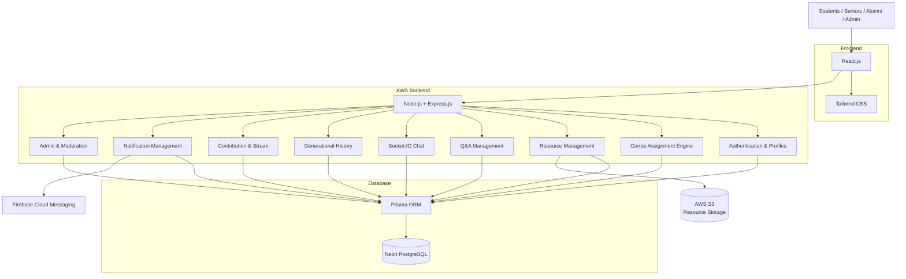
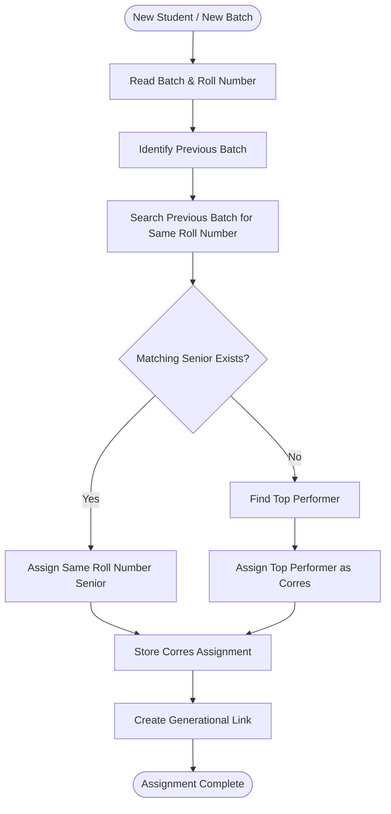
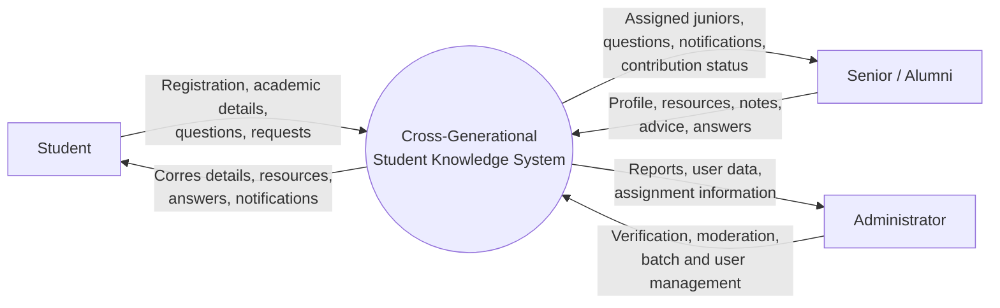
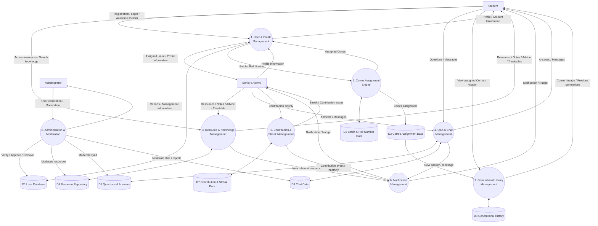
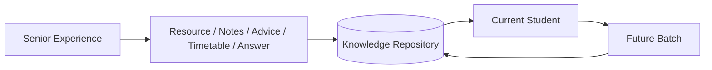
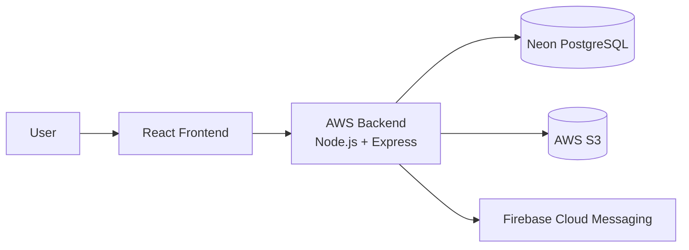

# System Design

## 1. Overview

The system is a **Cross-Generational Student Knowledge & Corres Platform** designed to preserve and transfer valuable knowledge between student batches.

The core design is based on an **automatic Corres assignment mechanism**:

* A junior is assigned the senior with the **same roll number from the previous batch**.
* If that roll number does not exist, the system assigns a **top-performing senior** as the fallback Corres.
* Corres relationships are preserved across generations, creating a long-term academic lineage.
* Resources, advice, notes, timetables, questions, answers, and interactions are retained as institutional knowledge.

The system follows a **modular monolithic architecture** to keep development simple and manageable during the hackathon.

---

# 2. System Architecture



---

# 3. Architecture Layers

## 3.1 Presentation Layer

### React.js

Responsible for the user interface for:

* Students
* Seniors
* Alumni
* Administrators

Major screens include:

```text
Login / Registration
Dashboard
Profile
Corres
Resource Directory
Questions & Answers
Chat
Generational History
Contribution / Streak
Admin Panel
```

### Tailwind CSS

Used for responsive styling and rapid UI development.

---

# 3.2 Application Layer

## Node.js + Express.js

Express acts as the central backend responsible for:

* REST APIs
* Authentication
* User management
* Corres assignment
* Resource management
* Q&A
* Generational history
* Contribution tracking
* Notifications
* Administration

The backend is organized into independent modules while remaining part of a single application.

---

# 3.3 Real-Time Communication

## Socket.IO

Socket.IO is used for real-time communication between:

```text
Student ↔️ Assigned Corres
```

It enables:

* Real-time messages
* Message delivery events
* Online interaction
* Chat notifications

---

# 3.4 Data Layer

## Neon PostgreSQL

PostgreSQL stores structured application data such as:

* Users
* Academic profiles
* Batches
* Roll numbers
* Corres assignments
* Generational relationships
* Resources metadata
* Questions
* Answers
* Chat messages
* Contributions
* Streak information
* Notifications

## Prisma

Prisma acts as the ORM between Express.js and PostgreSQL.

```text
Express.js
     ↓
Prisma
     ↓
Neon PostgreSQL
```

---

# 3.5 File Storage

## AWS S3

AWS S3 stores actual uploaded files such as:

* PDFs
* Handwritten notes
* Timetables
* Study material
* Project documents
* Other resources

PostgreSQL stores the metadata and S3 object reference.

```text
User uploads file
       ↓
Express.js
       ↓
AWS S3
       ↓
File URL / Object Key
       ↓
PostgreSQL
```

---

# 3.6 Notification Layer

## Firebase Cloud Messaging

FCM is used for notifications such as:

* New message
* New answer
* New resource
* Contribution reminder
* Corres activity

---

# 4. Corres Assignment Design

The Corres system is the core business logic of the platform.

## Assignment Rule

For each junior:

```text
Current Batch
      ↓
Find Previous Batch
      ↓
Search Same Roll Number
      ↓
Same Roll Number Found?
      /             \
    YES              NO
     ↓                ↓
Assign Same       Find Top
Roll Senior       Performer
     \                /
      \              /
       Corres Assigned
```

### Example

```text
Batch 2026 → 115 students
Batch 2025 → 114 students

2026 / Roll 1   → 2025 / Roll 1
2026 / Roll 2   → 2025 / Roll 2
...
2026 / Roll 114 → 2025 / Roll 114
2026 / Roll 115 → Top Performer
```

## Assignment Types

The system stores the reason for the assignment:

```text
SAME_ROLL
FALLBACK_TOP_PERFORMER
```

---

# 5. Corres Assignment Flow



---

# 6. Generational History Design

Each Corres relationship contributes to a continuing lineage.

Example:

```text
2026 / Roll 09
      ↓
2025 / Roll 09
      ↓
2024 / Roll 09
      ↓
2023 / Roll 09
      ↓
2022 / Roll 09
      ↓
...
```

This allows knowledge to survive across generations.

The system can associate each generation with:

* Resources
* Notes
* Advice
* Timetables
* Questions
* Answers
* Contributions
* Experiences

---

# 7. Data Flow Design

## Level 0 DFD



## Level 1 DFD



---

# 8. Major System Modules

| Module                    | Main Responsibility                             |
| ------------------------- | ----------------------------------------------- |
| Authentication & Profiles | Registration, login, roles, academic details    |
| Corres Assignment         | Same-roll matching and top-performer fallback   |
| Resource Management       | Upload, organize, search and download resources |
| Q&A                       | Questions and senior answers                    |
| Chat                      | Real-time Corres communication                  |
| Generational History      | Maintain cross-batch lineage                    |
| Contribution & Streak     | Track senior contributions and streaks          |
| Notifications             | Messages, reminders and contribution nudges     |
| Administration            | Verification, moderation and batch management   |

---

# 9. Core Data Entities

The initial database design will contain entities approximately corresponding to:

```text
User
Batch
CorresAssignment
GenerationalHistory
Resource
Question
Answer
Conversation
Message
Contribution
Streak
Notification
```

### High-Level Relationship

```text
User
 ├── belongs to → Batch
 ├── has → CorresAssignment
 ├── contributes → Resource
 ├── asks → Question
 ├── participates in → Conversation
 ├── makes → Contribution
 └── has → Streak

CorresAssignment
 └── creates → GenerationalHistory
```

---

# 10. Core Knowledge Flow



The system converts individual senior experience into **persistent institutional knowledge**.

---

# 11. Technology Stack

```text
Frontend
→ React.js
→ Tailwind CSS

Backend
→ Node.js
→ Express.js

Database
→ Neon PostgreSQL
→ Prisma ORM

File Storage
→ AWS S3

Real-Time Communication
→ Socket.IO

Authentication
→ JWT

Notifications
→ Firebase Cloud Messaging

Scheduled Tasks
→ node-cron

Deployment
→ AWS Backend
→ Vercel / AWS Frontend

Version Control
→ Git + GitHub
```

---

# 12. Deployment Architecture



---

# 13. Design Principles

### Simplicity

A modular monolithic architecture is used to reduce development and deployment complexity during the hackathon.

### Persistence

Useful knowledge should remain available after the original contributor graduates.

### Automatic Assignment

Corres allocation is rule-based and does not depend on manually finding seniors.

### Scalability

The system is designed to support multiple batches and eventually multiple institutions.

### Separation of Data and Files

Structured information is stored in PostgreSQL while uploaded files are stored in AWS S3.

### Generational Continuity

The system preserves relationships and knowledge across multiple student generations.

---

# 14. Current Design Scope

### Included

* User and academic profiles
* Automatic Corres assignment
* Same-roll matching
* Top-performer fallback
* Resource repository
* Resource uploads
* Q&A
* Real-time chat
* Contribution tracking
* Streaks
* Notifications
* Resource downloads
* Generational history
* Administration and moderation

### Future Enhancements

* AI-based recommendations
* AI-based document summarization
* Personalized study planning
* Advanced analytics
* Advanced knowledge ranking
* Additional gamification

---

# 15. Core Design Principle

> **What one generation learns should not be lost when that generation graduates.**

The system is designed to turn temporary senior-junior interaction into a **persistent, searchable and continuously growing cross-generational knowledge network**.